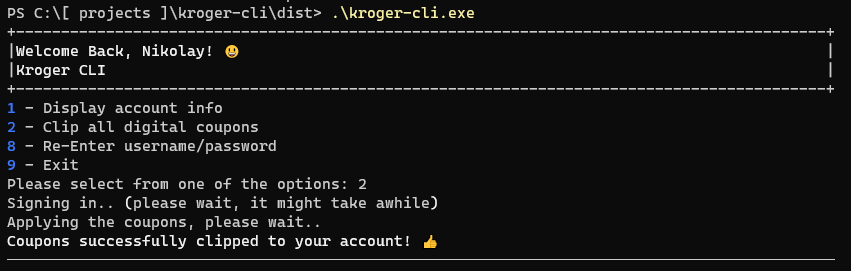

Kroger CLI
==========

The idea of the project is to create a command line utility that can automate certain tasks on the Kroger's website.

At this moment in time the application can:

* Display basic information from your account
* Clip all digital coupons

#### Side Notes

The initial plan was to use the `requests` package, however I couldn't sign in to the Kroger's website using it. Possibly had to do with csrf token validation. Because of that I had to use `pyppeteer`, which is a python's port of `Puppeteer` (Headless Chrome).