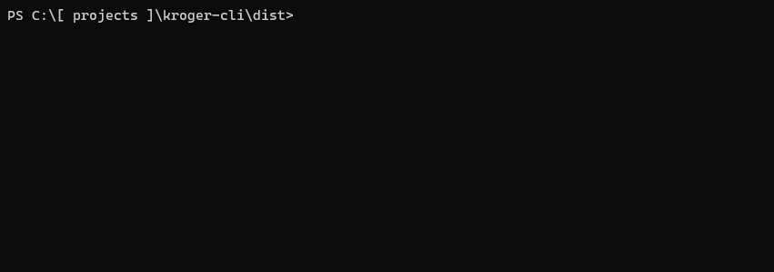
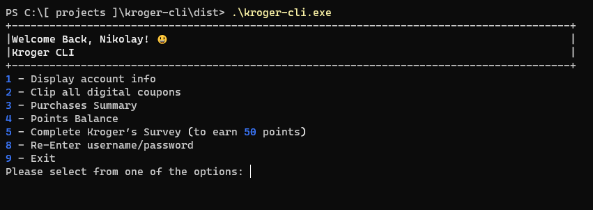
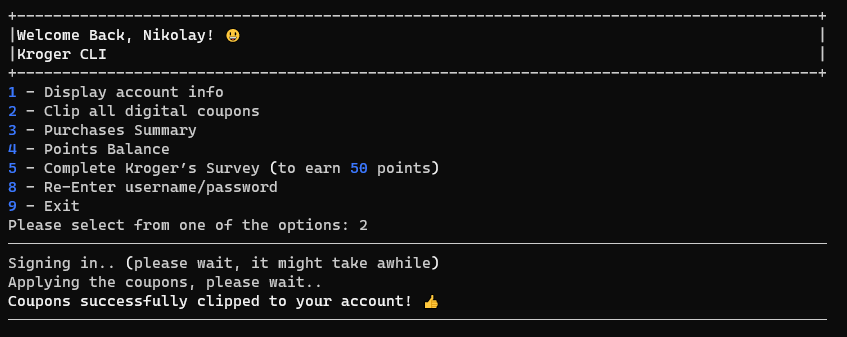
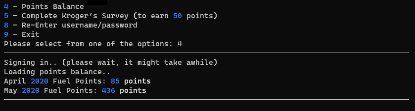

Kroger CLI
==========

The idea of the project is to create a command line utility that can automate certain tasks on the Kroger's website.

At this moment the application can:

* Display basic information from your account (name, address, rewards card number, etc)
* [Complete the Kroger’s Survey on your behalf](images/Kroger-Survey.gif) (to earn 50 points and enter the sweepstake)
* [Clip all Digital Coupons](#clip-digital-coupons) (first 150 coupons only, sorted by relevance)
* [Display Purchases Summary](#purchases-summary) (number of store visits and dollars spent)
* [Retrieve Points Balance](#fuel-points-balance)

#### TODO

* Command Line Arguments, to allow something like that: `kroger-cli --clip-digital-coupons`

#### Side Notes

The initial plan was to use the `requests` package, however I couldn't sign in to the Kroger's website using it. Possibly had to do with csrf token validation. Because of that I had to use `pyppeteer`, which is a python's port of `Puppeteer` (Headless Chrome).

Screenshots
-----------

### Main Interface

### Clip Digital Coupons

### Purchases Summary

### Fuel Points Balance

### Complete Kroger's Feedback Form

[Watch](images/Kroger-Survey.gif)